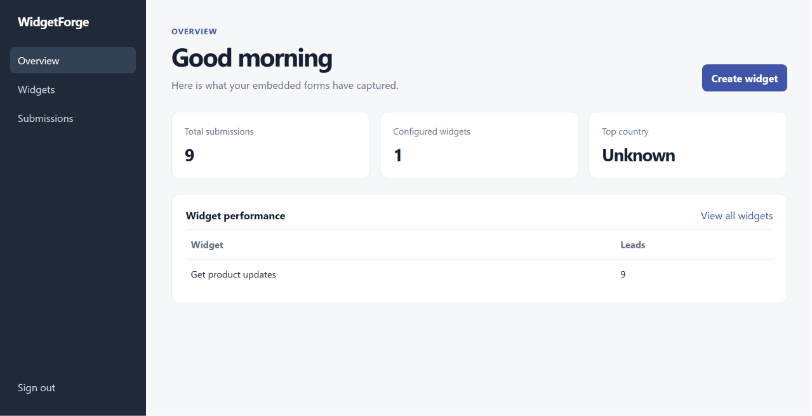
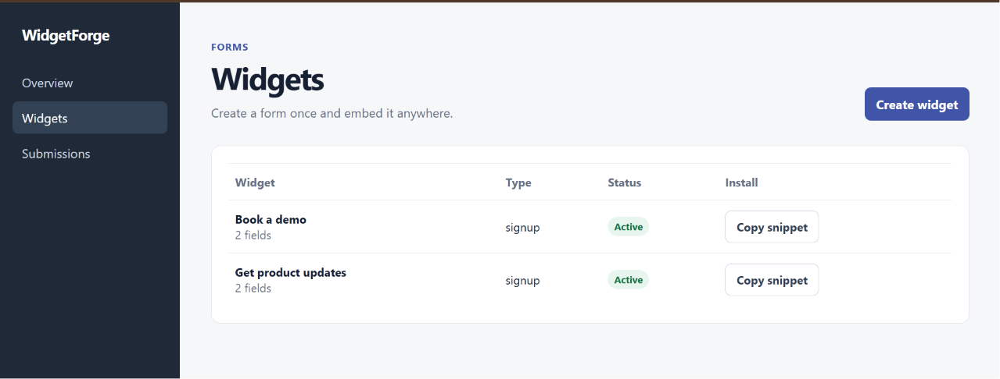
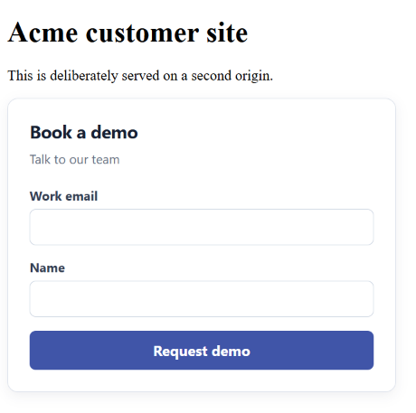
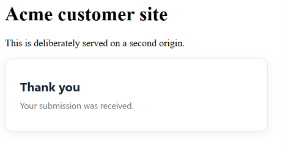

<div align="center">

# WidgetForge

### A hardened, multi-tenant platform for embeddable lead-capture forms

[](https://www.python.org/)
[](https://fastapi.tiangolo.com/)
[](https://react.dev/)
[](https://www.postgresql.org/)


**[Quick start](#quick-start)** · **[Live proof](#live-proof)** · **[Architecture](#architecture)** · **[API](#api-surface)** · **[Documentation](#documentation)**

</div>

## Overview

WidgetForge lets a customer configure a signup or contact form, copy one `<script>` tag, and collect leads from any permitted website. Owners manage widgets and leads in a React dashboard; visitors interact with a lightweight framework-free embedded widget.

The core challenge is safely accepting input from browsers the platform does not control. WidgetForge therefore treats the public submission endpoint as an untrusted boundary and proves its behaviour with automated failure-mode tests.

> A project for demonstrating backend engineering beyond CRUD: multi-tenancy, public API security, HTTP caching, idempotent writes, graceful dependency failure, and durable side effects.

## Product flow

```text
Owner signs in → creates widget → copies one script tag → pastes it on customer website
                                                            │
                                                            ▼
Visitor loads widget → submits form → protected public API → lead stored → owner dashboard
```

## Highlights

| Capability | Implementation |
|---|---|
| **Multi-tenant ownership** | Tenant identity comes from the JWT; owner queries are scoped by tenant. |
| **Embed delivery** | Versioned `widget.v1.js` plus a compact public config endpoint with ETag revalidation. |
| **Public API hardening** | Explicit CORS/preflight, body-size guard, config-driven validation, clean 4xx errors. |
| **Abuse controls** | Honeypot spam detection and an in-memory per-IP/widget rate limiter returning `429`. |
| **Reliable writes** | An `Idempotency-Key` prevents duplicate form submissions on retry. |
| **Resilient enrichment** | Geo provider A → provider B → store-without-geo fallback chain. |
| **Failure-safe notification** | Submission and outbox event are written atomically; notifier failures retry without losing a lead. |
| **Owner experience** | React dashboard for metrics, widgets, copyable install snippets, and submissions. |

## Architecture

```text
                          ┌────────────────────────────┐
                          │       React dashboard       │
                          │      localhost:5173         │
                          └──────────────┬─────────────┘
                                         │ JWT
                                         ▼
┌──────────────┐      ┌───────────────────────────────────────────┐
│ Customer site│─────►│ FastAPI                                    │
│ localhost:8080│     │ owner API · public config · submissions   │
└──────┬───────┘     └──────┬─────────────┬──────────────────────┘
       │                    │             │
       ▼                    ▼             ▼
widget.v1.js           PostgreSQL    Geo A → Geo B → no geo
       │                    │
       └─────► public submit └── transaction: submission + outbox
                                               │
                                               ▼
                                      notification worker / retry
```

The application is intentionally a **modular monolith**: route, service, repository, integration, and worker boundaries are clear, but it remains easy to run and reason about locally. See the [architecture document](docs/ARCHITECTURE.md) and [ADRs](docs/adr/) for trade-offs.

## Tech stack

| Layer | Technology |
|---|---|
| Owner UI | React, TypeScript, Vite, plain CSS |
| Embedded widget | Framework-free JavaScript with scoped `wf-` styles |
| API | Python, FastAPI, Pydantic |
| Persistence | PostgreSQL, SQLAlchemy |
| Authentication | JWT bearer tokens, Passlib/bcrypt password hashing |
| Local platform | Docker Compose |
| Verification | `unittest`, deterministic fakes for geo and notification dependencies |

## Live proof

### Owner dashboard

The dashboard displays tenant-scoped metrics and widget performance.



### Widget management

Owners can create forms and copy a real API-generated embed snippet.



### Cross-origin embedded form

The visitor widget is loaded from the API on a different origin and rendered with isolated styles.



### Successful public capture

The widget gives the visitor a safe confirmation after the public API accepts the submission.



Token-bearing and personal-data screenshots are intentionally excluded from version control. See the [screenshot evidence index](docs/screenshots/README.md).

## Quick start

### Prerequisites

- Docker Desktop with Docker Compose
- Python 3.11+ (only for serving the second-origin demo page)
- Node.js 20+ and npm (only for the React dashboard)

### 1. Start the backend and database

```powershell
git clone https://github.com/SaraArif6198/flyrank-capstone-widgetforge-.git
cd flyrank-capstone-widgetforge-
Copy-Item .env.example .env
docker compose up --build -d
docker compose exec api python scripts/seed_demo.py
```

The API is available at `http://localhost:8000/docs`. PostgreSQL is intentionally internal to Docker—there is no host `5432` mapping to conflict with a local database.

### 2. Start the owner dashboard

```powershell
cd frontend
npm.cmd install
npm.cmd run dev
```

Open `http://localhost:5173` and sign in with:

| Email | Password |
|---|---|
| `alice@acme.test` | `DemoPass123!` |

### 3. Test the customer-site embed

1. In the dashboard, open **Widgets** and click **Copy snippet**.
2. Replace the script tag in `customer-site/index.html` with the copied snippet.
3. From the repository root, run:

   ```powershell
   python -m http.server 8080 --directory customer-site
   ```

4. Open `http://localhost:8080`, submit the form, then return to **Submissions** in the dashboard.

For the evaluator-ready walkthrough, see [DEMO.md](DEMO.md).

## API surface

| Route | Description |
|---|---|
| `POST /api/v1/auth/login` | Authenticate owner and return JWT. |
| `GET/POST /api/v1/widgets` | List/create tenant-owned widgets. |
| `GET/PATCH/DELETE /api/v1/widgets/{id}` | Read/update/deactivate a widget. |
| `GET /api/v1/widgets/{id}/embed` | Return the one-line install snippet. |
| `GET /public/v1/widgets/{public_id}/config` | Return cacheable safe rendering config. |
| `POST /public/v1/submissions` | Accept a protected public lead submission. |
| `GET /api/v1/submissions` | List authenticated tenant submissions. |
| `GET /api/v1/dashboard/summary` | Read owner metrics and aggregates. |

Interactive OpenAPI documentation is available at `/docs`; the complete contract is in [docs/API_CONTRACT.md](docs/API_CONTRACT.md).

## Verification

Run the backend suite inside its actual Docker environment:

```powershell
docker compose exec api python -m unittest discover -s tests -v
```

**7/7 automated tests pass.** They cover:

- Tenant A / Tenant B authorization isolation
- Widget CRUD validation errors
- CORS headers, preflight, cache headers, and ETag `304`
- Public submission idempotency
- Honeypot and rate-limit behaviour
- Geo fallback and both-providers-down degradation
- Notification failure isolation and outbox retry state
- Dashboard isolation

Build the frontend independently:

```powershell
cd frontend
npm.cmd run build
```

## Security and engineering decisions

- No client-supplied tenant ID is trusted.
- `.env`, local database files, JWT-bearing screenshots, and personal-data screenshots are gitignored.
- Public config never exposes owner identity, secrets, or lead data.
- The widget uses safe DOM APIs and does not inject untrusted HTML.
- External enrichment and notification failures are non-critical by design.
- The initial rate limiter is intentionally local-process only; Redis/API gateway replacement is documented as a production extension.

## Documentation

- [Product requirements](docs/PRD.md)
- [Architecture](docs/ARCHITECTURE.md)
- [Data model](docs/DATA_MODEL.md)
- [API contract](docs/API_CONTRACT.md)
- [Security & resilience](docs/SECURITY.md)
- [Test strategy](docs/TEST_STRATEGY.md)
- [Backend implementation plan](docs/IMPLEMENTATION_PLAN.md)
- [UI implementation plan](docs/UI_IMPLEMENTATION_PLAN.md)
- [Portfolio roadmap](docs/PORTFOLIO.md)
- [Architecture decision records](docs/adr/)

## Limitations and next steps

WidgetForge is a local-first portfolio capstone. It is not a production deployment or privacy-compliance certification. The most valuable next improvements are Redis-backed rate limiting, structured observability/correlation IDs, user-managed allowed origins, signed webhook delivery, and a separately deployed notification worker.

---

Built as a FlyRank Backend Engineering capstone. The UI exists to make the backend guarantees visible—not to hide them.
