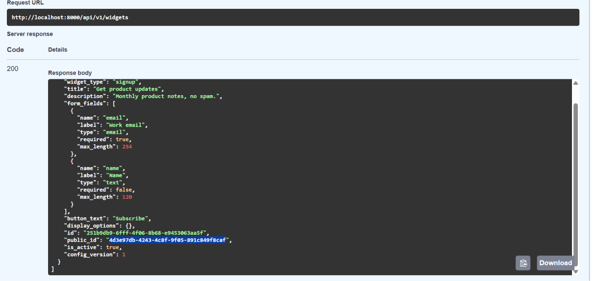
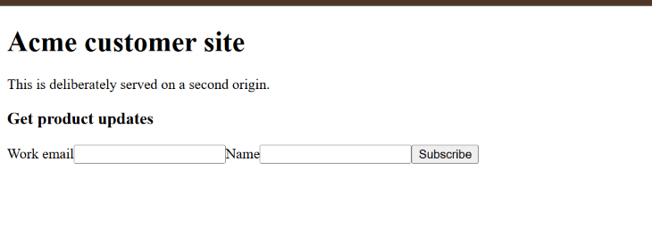
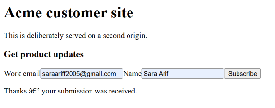

# WidgetForge

**A multi-tenant embeddable lead-capture platform built for untrusted public traffic.**

WidgetForge lets an owner configure a signup or contact form, install it on any website with one `<script>` tag, and review captured leads through authenticated dashboard APIs. The main engineering challenge is not rendering the form—it is safely accepting data from browsers and origins the platform does not control.

The public submission path is deliberately hardened with CORS/preflight handling, request-size limits, schema validation, a honeypot, per-IP/widget rate limiting, idempotent writes, geo-provider fallback, and a transactional outbox for failure-safe notifications.

## Why this project

Typical embedded forms fail when exposed to the open internet: they trust client data, duplicate submissions after retries, leak tenant data, or turn a failed third-party call into a lost lead. WidgetForge demonstrates a backend-first approach to those problems:

- **Multi-tenant isolation:** all owner data access is scoped by the tenant in the JWT, not a client-supplied tenant ID.
- **Safe public writes:** browsers from an allowed external origin can submit; malformed, oversized, spammy, or burst traffic is rejected intentionally.
- **Graceful degradation:** geo enrichment tries a primary provider, then a fallback, then stores the lead without geo rather than failing.
- **Failure-safe side effects:** lead and outbox event are written atomically; notification failure never changes a successful submission response.
- **Cache-aware widget delivery:** the versioned JavaScript bundle is immutable-cacheable while widget configuration uses short-lived caching and ETags.

## Architecture

```text
Owner (JWT) ──► Widget & Dashboard API ──► Services ──► PostgreSQL
                                                    ▲
Customer website ──► widget.v1.js ──► Public config ┘
       (second origin)                   │
                                         ▼
Visitor ──► Public submission API ─► validate → rate limit/spam → geo A → geo B
                                         │                              │
                                         └── atomic lead + outbox ──────┘
                                                       │
                                                       ▼
                                            notification worker / retry
```

The initial implementation is a modular monolith: FastAPI, SQLAlchemy, PostgreSQL, Docker Compose, and a framework-free widget bundle. It keeps local setup and transactional guarantees simple while retaining interfaces that can later support Redis rate limiting or a separate worker.

## Features

| Area | Included behaviour |
|---|---|
| Owner management | JWT login, tenant-isolated widget CRUD, and per-widget embed snippet generation. |
| Widget delivery | Versioned `widget.v1.js`, public config, cache headers, ETag revalidation, and a plain second-origin demo site. |
| Public submissions | Config-driven field validation, 16 KB body limit, explicit CORS/preflight, generic JSON errors, and idempotency keys. |
| Abuse resistance | Hidden honeypot and per-IP/widget in-memory rate limiter returning `429` with `Retry-After`. |
| Resilience | Deterministic geo provider A → B fallback → no-geo degradation and a durable outbox worker with bounded retries. |
| Dashboard | Tenant-only submission list plus total, per-widget, and country aggregation APIs. |
| Verification | Seven automated tests covering authorization, CORS, cache revalidation, replay protection, abuse controls, provider failure, notification failure, and dashboard isolation. |

## Quick start

Prerequisites: Docker Desktop and Docker Compose.

```powershell
git clone https://github.com/SaraArif6198/flyrank-capstone-widgetforge-.git
cd flyrank-capstone-widgetforge-
Copy-Item .env.example .env
docker compose up --build -d
docker compose exec api python scripts/seed_demo.py
docker compose exec api python -m unittest discover -s tests -v
```

Open these URLs after startup:

- API documentation: `http://localhost:8000/docs`
- Health check: `http://localhost:8000/health`

### Owner dashboard UI

In a second terminal, start the React dashboard:

```powershell
cd frontend
npm.cmd install
npm.cmd run dev
```

Open `http://localhost:5173`. The UI uses Vite's local API proxy, so it works with the Dockerized API without exposing a new CORS policy. The current owner UI includes real login, dashboard metrics, widget listing/creation, copyable installation snippets, and a tenant-safe submissions table.

The Compose database is intentionally **not** mapped to host port 5432. The API reaches it safely through Docker’s internal network, avoiding conflicts with local PostgreSQL instances.

### Demo credentials

| Tenant | Email | Password |
|---|---|---|
| Acme Labs | `alice@acme.test` | `DemoPass123!` |
| Beta Studio | `bob@beta.test` | `DemoPass123!` |

These are deterministic local demo credentials only.

## Run the embed demo

1. Use `/docs` to log in as Alice and call `GET /api/v1/widgets`.
2. Copy the returned widget `public_id`.
3. Replace `REPLACE_WITH_PUBLIC_ID` in `customer-site/index.html`.
4. In a second terminal, run:

   ```powershell
   python -m http.server 8080 --directory customer-site
   ```

5. Open `http://localhost:8080`, submit the form, then call `GET /api/v1/submissions` and `GET /api/v1/dashboard/summary` in Swagger.

For the complete six-minute acceptance walkthrough, see [DEMO.md](DEMO.md).

## API surface

| Route | Purpose |
|---|---|
| `POST /api/v1/auth/login` | Get owner JWT. |
| `POST/GET /api/v1/widgets` | Create and list tenant-owned widgets. |
| `GET/PATCH/DELETE /api/v1/widgets/{id}` | Manage one tenant-owned widget. |
| `GET /api/v1/widgets/{id}/embed` | Generate installation snippet. |
| `GET /widget.v1.js` | Serve immutable versioned widget bundle. |
| `GET /public/v1/widgets/{public_id}/config` | Serve cacheable public configuration. |
| `POST /public/v1/submissions` | Hardened public lead capture. |
| `GET /api/v1/submissions` | List tenant-only leads. |
| `GET /api/v1/dashboard/summary` | Read tenant-only aggregate metrics. |

See the detailed [API contract](docs/API_CONTRACT.md) and interactive OpenAPI docs at `/docs`.

## Verification and evidence

```powershell
docker compose exec api python -m unittest discover -s tests -v
```

The Dockerized suite passes **7/7 tests**. It proves:

- Tenant B cannot read, update, or delete Tenant A’s widget or view Tenant A’s dashboard data.
- Invalid widget schemas return structured `422` errors.
- The public config is CORS-enabled, short-cacheable, and returns `304` on ETag revalidation.
- Submission retries with the same idempotency key return the same lead ID.
- Honeypot and rate-limiting controls behave as designed.
- Primary geo failure uses the fallback; total geo failure still stores the lead.
- Notification failure leaves the accepted submission committed and creates a retriable outbox event.

## Live proof

### Authenticated widget configuration

The owner API returns the configured form definition and an opaque public widget ID.

<p align="center">
  
</p>

### Cross-origin widget delivery

The widget bundle renders on a customer page served from a different origin.

<p align="center">
  
</p>

### Successful public lead capture

The visitor submits configured fields and receives a safe confirmation response.

<p align="center">
  
</p>

Bearer-token screenshots are intentionally excluded from version control. The [screenshot evidence index](docs/screenshots/README.md) documents the safe public images.

## Design and engineering notes

- [Product requirements document](docs/PRD.md)
- [Architecture and request flows](docs/ARCHITECTURE.md)
- [Data model](docs/DATA_MODEL.md)
- [Security and resilience plan](docs/SECURITY.md)
- [Test strategy](docs/TEST_STRATEGY.md)
- [Implementation plan](docs/IMPLEMENTATION_PLAN.md)
- [Architecture decision records](docs/adr/)
- [Portfolio positioning and extension roadmap](docs/PORTFOLIO.md)
- [UI implementation plan](docs/UI_IMPLEMENTATION_PLAN.md)

## Limitations and next steps

This is a local-first capstone, not a production-hosted service. The in-memory rate limiter applies to one API process; production deployment should replace it with Redis, an API gateway, or a WAF. The geo providers are deterministic fakes in tests; real provider adapters need operational rate-limit/retention review. Privacy compliance, user-managed allowed origins, audit logging, observability metrics, signed webhooks, and a dedicated worker process are deliberate next-step enhancements.

The best portfolio extension is structured observability: request correlation IDs, JSON logs, readiness checks, and counters for accepted/rejected/fallback/failed-notification events.
